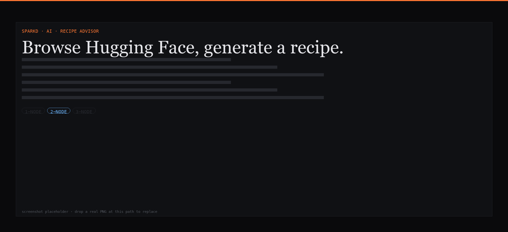
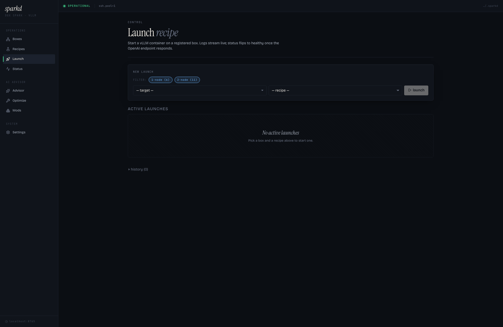
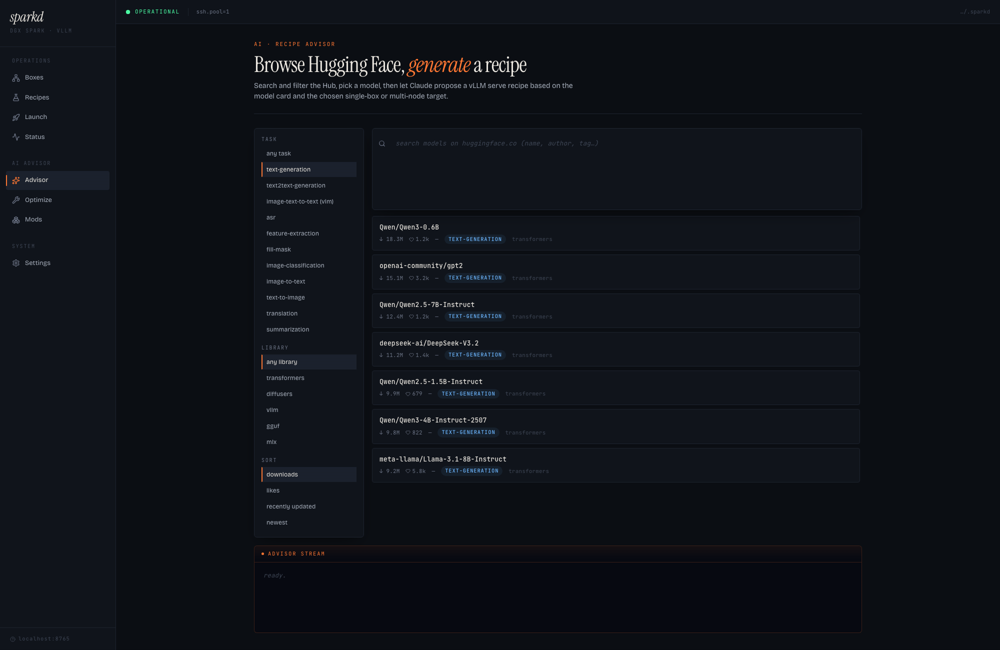
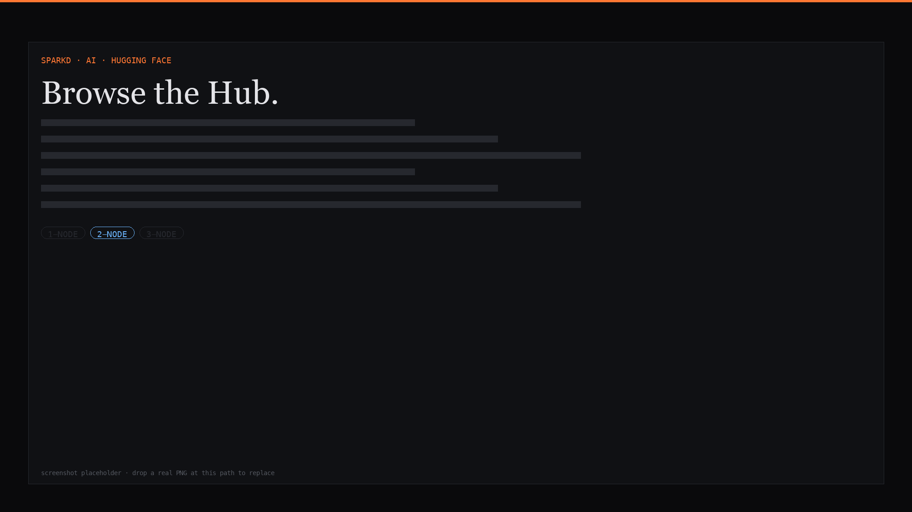
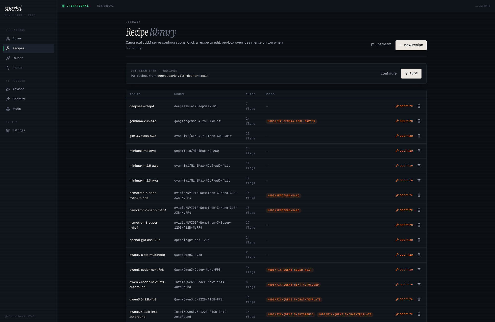
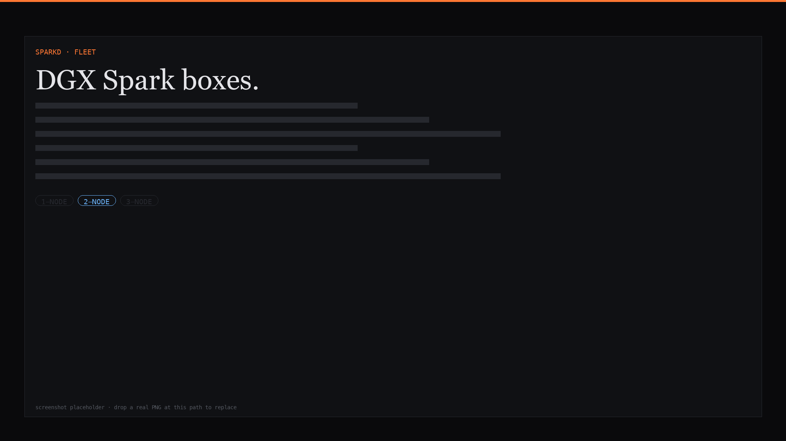
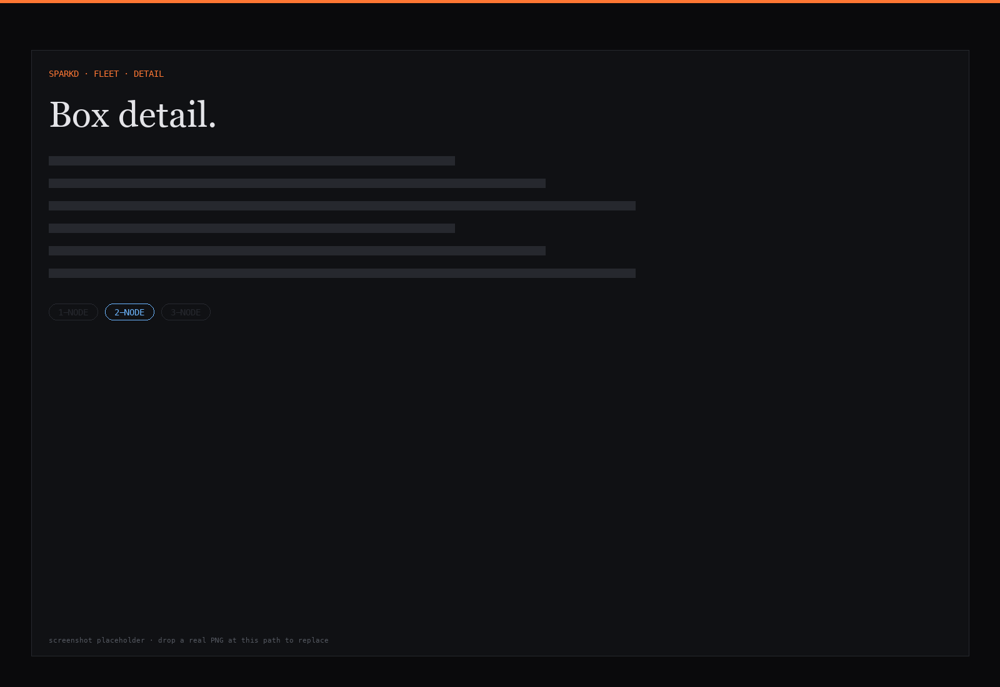
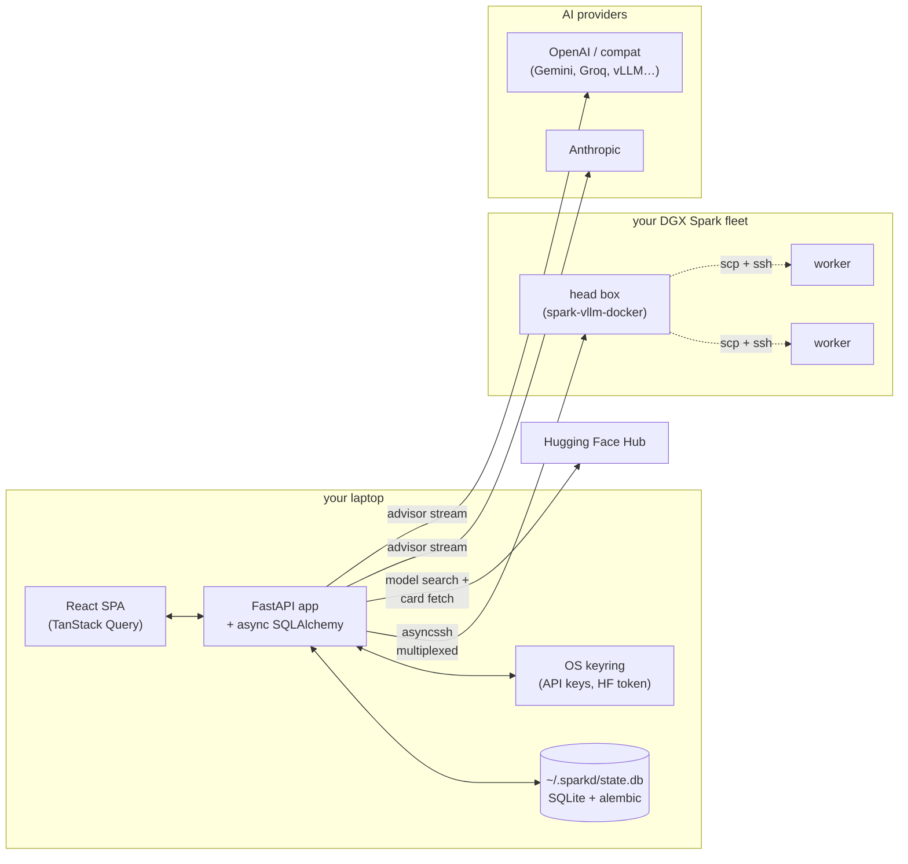

<div align="center">

# `sparkd`

### A localhost command-center for your **NVIDIA DGX Spark** fleet.

**Browse Hugging Face. Generate a vLLM recipe with Claude. Ship it across one box or a cluster — straight from your laptop.**

[](https://www.python.org/downloads/)
[](https://fastapi.tiangolo.com/)
[](https://react.dev/)
[](#testing)
[](#license)

<br />



</div>

---

## Why sparkd?

If you own a DGX Spark — or a small fleet of them — you've felt the gap. The hardware is gorgeous. The vLLM ecosystem is fast-moving. The **glue** between them — picking a model, sizing a recipe, running it across nodes, watching it actually serve — is bash, SSH, and prayers.

**sparkd is the glue.** It's the dashboard you've been writing yourself, three commands at a time, in a tmux window.

| Without sparkd | With sparkd |
|---|---|
| SSH into a box, edit a YAML by hand, hope tp×pp matches the GPU count | Pick the box (or cluster) from a dropdown — recipes auto-filter to what fits |
| Read three model cards on HF, ask GPT for tp/pp guidance, paste flags | Click a model in the built-in HF browser → Claude reads the card and generates a tuned recipe |
| Ray cluster bring-up = `launch-cluster.sh` + `tmux` + finger-crossed | Tag two boxes `cluster=alpha`, hit launch, walk away |
| `tail -f` across N tmux panes for one launch | Live logs stream into the dashboard, per launch, with pause / inspect / stop |
| "What changed since v3?" | Built-in version history with side-by-side diff and one-click revert |

**No cloud. No telemetry. No account.** sparkd runs on your laptop, talks to your boxes over SSH, and stores everything in `~/.sparkd/` on your machine.

---

## What it does

### 🚀 Launch on one box or many — same form, smarter recipe filter

Pick a target. The recipe dropdown filters itself to what fits. Single-box target → only single-node recipes. Cluster of 2 → only `tp×pp == 2` recipes. Don't like the auto-filter? **Toggle the chip row** to show whatever node count you want.

When you hit launch on a cluster, sparkd SSHes the head node and runs `./run-recipe.sh -n h1,h2,h3 <recipe>` — upstream `launch-cluster.sh` handles the worker fan-out, Ray bootstrap, and NCCL config. **Zero new orchestration code in sparkd.**



### 🤖 Claude reads model cards, you ship recipes

The Advisor sees the Hugging Face model card, the target's capabilities (per-node GPU + VRAM, IB interface), and — for clusters — the full topology including total GPUs and aggregate VRAM. It produces a tuned recipe with `--tensor-parallel-size`, `--pipeline-parallel-size`, `distributed-executor-backend=ray`, and `NCCL_SOCKET_IFNAME` set for your hardware.

Bring your own provider: **Anthropic, OpenAI, Gemini, Mistral, Groq, OpenRouter, Together, or a local vLLM endpoint**. Keys live in your OS keyring. Switch active provider from Settings.



### 📚 Full Hugging Face browser, in the box

Search the Hub from the dashboard. Filter by pipeline tag, library, sort by downloads / likes / recent. Click a model → see the card → ask Claude to plan a recipe for it on your hardware. Drop in your HF token under **Settings → Hugging Face** for gated repos.



### 🧬 Recipe versioning, with diff and revert

Every save appends a new version with its YAML, source tag (manual / AI / sync), and an optional note. The History tab shows a side-by-side diff. Roll back any time.



### 🧱 Multi-node clusters as a first-class target

Tag two or more boxes with the same `cluster` value (autocomplete picks up existing clusters as chips) — they form a cluster. Clusters appear in **every** target picker on the app: Launch, Optimize, Advisor, AI assist. The `cluster:<name>` convention is the same encoding everywhere.



### 📦 Box detail page

Each registered box has its own page: live status, hardware capabilities (refresh on demand), every launch ever made on it, edit/test/delete controls, and the cluster ChipInput so you can re-tag it without leaving the form.



---

## Architecture



**Single-box launch:** sparkd SSHes the box and runs `./run-recipe.sh <recipe>`.
**Cluster launch:** sparkd SSHes the head box and runs `./run-recipe.sh -n h1,h2,h3 <recipe>`. Upstream `run-recipe.py` invokes `launch-cluster.sh`, which scps the launch script to workers and bootstraps Ray. sparkd doesn't reinvent multi-node orchestration — it delegates to the tool that already does it well.

---

## Quick start

**Prerequisites**
- Python **3.12+**
- [`uv`](https://github.com/astral-sh/uv) (or `pip` if you prefer)
- Node 20+ (only if you're rebuilding the SPA bundle)
- An NVIDIA DGX Spark with [`eugr/spark-vllm-docker`](https://github.com/eugr/spark-vllm-docker) cloned at `~/spark-vllm-docker`
- SSH access to that box (key-based, ideally via `ssh-agent`)

**Install + run**

```bash
git clone https://github.com/mchenetz/sparkd
cd sparkd
uv sync
uv run sparkd serve
```

Then open **http://localhost:8765**.

**First five minutes**

1. **Settings → AI** — add an Anthropic API key (or any other supported provider).
2. **Settings → Hugging Face** — drop in your HF token if you want gated models.
3. **Boxes → register a new box** — give it a name, host (Tailscale name works), user, repo path.
4. *(Optional)* on Box Detail, set the **cluster** chip to group it with other boxes.
5. **Advisor** — search HF, pick a model, pick your target, hit **ask claude**. Apply the draft.
6. **Launch** — pick the target, pick the recipe, hit launch. Watch logs stream.

---

## Multi-node walkthrough

Have two or more DGX Sparks? Run a model that doesn't fit on one.

```
1. On each box's detail page, set the cluster chip to "alpha"
   ↳ "alpha" now appears in every target dropdown as
     "alpha — 2 nodes" under "clusters (multi-node)"

2. Advisor → search HF → pick a 70B model
   ↳ Target = cluster:alpha
   ↳ "plan multi-node" — Claude sees per-node caps + total GPUs
                         + aggregate VRAM and proposes tp/pp split,
                         Ray setup, NCCL_SOCKET_IFNAME

3. Apply the draft → Save as a new recipe (e.g. llama-70b-cluster)

4. Launch → target = alpha
   ↳ chip filter auto-selects "2-node"
   ↳ recipe dropdown shows recipes whose tp×pp == 2
   ↳ Hit launch
     • sparkd: ssh head 'cd ~/spark-vllm-docker && yes | ./run-recipe.sh -n h1,h2 llama-70b-cluster'
     • upstream launch-cluster.sh: scp launch script to worker, start
       Ray on both, run vLLM serve across the cluster
   ↳ LaunchRecord shows: [healthy] llama-70b-cluster [alpha · 2 nodes]
```

---

## Recipe shape

Recipes are YAML in `~/.sparkd/recipes/`. They follow the upstream `spark-vllm-docker` format with sparkd-friendly extras (description, mods list, structured args).

```yaml
recipe_version: 1
name: llama-70b-cluster
description: Llama-3.1-70B-Instruct across an alpha cluster (2 nodes, tp=2)
model: meta-llama/Llama-3.1-70B-Instruct
container: vllm-node
mods:
  - drop-caches
defaults:
  port: 8000
args:
  --tensor-parallel-size: "2"
  --pipeline-parallel-size: "1"
  --distributed-executor-backend: ray
  --gpu-memory-utilization: "0.92"
  --max-model-len: "16384"
env:
  NCCL_SOCKET_IFNAME: ibp0
  GLOO_SOCKET_IFNAME: ibp0
command: |
  vllm serve {model}
    --port {port}
    --tensor-parallel-size 2
    --distributed-executor-backend ray
```

---

## Tech stack

**Backend** — FastAPI · async SQLAlchemy · alembic · Pydantic v2 · asyncssh · keyring · structlog
**Frontend** — React 18 · Vite · TypeScript · TanStack Query · react-router · lucide-react
**AI** — Anthropic SDK + OpenAI SDK (any compatible endpoint)
**Storage** — SQLite at `~/.sparkd/state.db` (migrations auto-apply on boot)

---

## Testing

```bash
uv run pytest -q          # 169 tests, ~10s
uv run pytest -v --cov    # with coverage
```

Tests are split between `tests/unit/` (pure logic) and `tests/integration/` (FastAPI + asyncssh fakes). The SSH fake is in `tests/ssh_fakes.py` — every `pool.run()` against a `FakeBox` is asserted on, so we can pin exact command shapes (e.g. cluster launches must contain `-n host1,host2,...`).

---

## Status

**v0.0.1 — pre-release.** APIs and DB schemas are not frozen. The app is built for a single local user; it's not hardened for multi-tenant use.

**Things that work today**
- Boxes, clusters, recipes, mods, launches, versioning, HF browser, AI advisor (recipe + optimize + mod modes)
- Multi-provider AI Settings (Anthropic, OpenAI, Gemini-compat, Groq, Mistral, OpenRouter, Together, local vLLM)
- Multi-node launches via upstream `launch-cluster.sh`
- Live log streaming, pause / unpause / restart / inspect / stop
- Recipe versioning with diff + AI-assist "apply to form / save as new"

**Things on the radar**
- Per-node status panel for cluster launches
- Recipe-set mode (one recipe, multiple variants per cluster size)
- Cluster-aware library views ("recipes compatible with this cluster")

---

## Contributing

PRs welcome. The repo uses a `docs/superpowers/specs/` and `docs/superpowers/plans/` workflow — features start as a written spec, get an implementation plan, then ship in TDD-shaped commits. See [`docs/superpowers/specs/`](docs/superpowers/specs/) for examples.

Quick sanity check before sending a PR:

```bash
uv run pytest -q
cd frontend && npm run build
```

---

## Acknowledgements

- [`eugr/spark-vllm-docker`](https://github.com/eugr/spark-vllm-docker) — the upstream tool sparkd wraps. All the actually-hard distributed-vLLM-on-DGX-Spark work lives there.
- [vLLM](https://github.com/vllm-project/vllm) — the inference engine.
- [NVIDIA DGX Spark](https://www.nvidia.com/en-us/products/workstations/dgx-spark/) — the hardware.
- [Anthropic Claude](https://www.anthropic.com/claude) — the recipe co-pilot.

---

## License

MIT — see [`LICENSE`](LICENSE).

Built by [@mchenetz](https://github.com/mchenetz) with help from [Claude](https://www.anthropic.com/claude).
